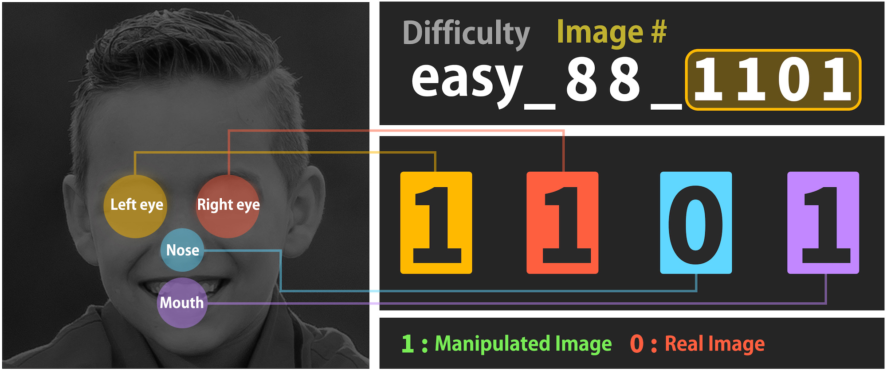
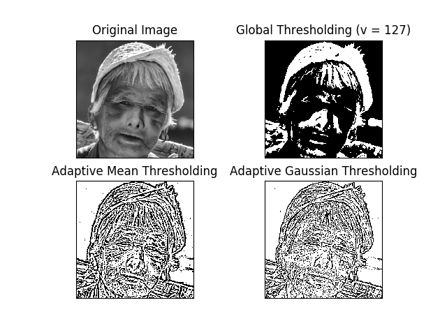

# Detecting fake faces 

Gabriel Biscaro Cavallari 
#USP 9292862

Facial recognition is being used in many systems and applications. In some cases it's important to detect if fake images are being uploaded by the user to the system in a registration process. This project aims to detect "photoshopped" frontal face images. The goal of this project is to detect likely regions that have been modified using photo editing tools. 

1. Main Objective: Given a frontal face image, detect likely regions that have been modified using photo editing tools. 

2. Description of input images: the dataset contais three groups of fake photos: easy, mid, and hard. It's possible to use the filenames of the fake images to know what have been manipulated:

Examples of images:

Source of the images: https://www.kaggle.com/ciplab/real-and-fake-face-detection 

3. Steps to reach the objective:

I. Explore simple methods: Simple Thresholding, Adaptive Thresholding, Otsu’s Binarization and multiple filters. Also texture analysis and color analysis. 

II. Explore some image forensics techniques, such as Noise Detection and Error Level Analysis (ELA). 

III. The methods above should be enough to correctly detect the manipulated parts of the easy images. For the mid and hard images, if necessary, a CNN will be trained.   

IV. Compare my results with the "ground truth", obtaining an accuracy for easy, mid and hard photos, since it's possible to use the filenames of the fake images to know what have been manipulated. 

First results obtained:

