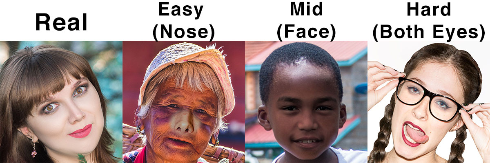

# Detecting fake faces 

Gabriel Biscaro Cavallari 
#USP 9292862

Facial recognition is being used in many systems and applications. In some cases it's important to detect if fake images are being uploaded by the user to the system in a registration process. This project aims to detect "photoshopped" frontal face images. Exploring image description and deep learning techniques, the goal of this project is to detect likely regions that have been modified using photo editing tools. 

Dataset: https://www.kaggle.com/ciplab/real-and-fake-face-detection 

